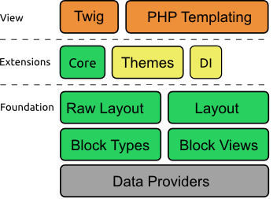

Oro Layout Component
====================

**IMPORTANT**: This component is not finished yet.

`Oro Layout Component` provides tools for

- defining elements of layout, so-called blocks, that can be used for building a different types of layouts, including HTML, XML and so on.
- manage a layout structure and themes.

Introduction
------------

The `Oro Layout Component` has several key concepts which need to be understood before you start learning this functionality:

 - A layout is a set of widgets are arranged in a hierarchy structure. Where a widget is some logical block contains some content.
 - Neither the layout nor a widget do not know how they should be converted (or in other words, rendered) into output string, for example HTML. To make this conversion we are using renderers, for example a renderer based on TWIG templates. 
 - The root idea and implementation of Oro layouts are mostly similar to Symfony's [Forms](http://symfony.com/doc/current/book/forms.html) component, but big difference is that layouts support only on-way data flow. It means that content of layout widgets can be rendered based on data, but layouts cannot be used to process user-submitted data.
 - There are two core layout widgets:
	- **block**
	The block represents a widget which cannot contain any other widgets. Examples of blocks can be a label, a chart, a grid and so on.
	- **container**
	The container is a structural widget which can contain other widgets. Examples of containers can be a header, a side bar, a page body and so on.

High-Level Architecture
-----------------------

The Oro Layout component includes three main layers:

 - The **Foundation** layer provides main architectural components are used to build a layout.
 - The **Extensions** layer extends the layout with some more useful features like loading widgets from DI container and working with layout inheritance.
 - The **View** layer provides components responsible for translating a layout to rendering HTML, XML or any other format.

The Oro Layout component provides several pluggable extensions out of the box:

 - The **Core** extension provides all widget definitions (called block types) implemented by the component.
 - The **DI** extension adds support for Symfony's [Dependency Injection](http://symfony.com/doc/current/components/dependency_injection/introduction.html) component.
 - The **Themes** extensions allows to build layouts based on other layouts and provide flexible configuration of layouts.

Low-Level Architecture
-----------------------

Here is a list of most important classes of Oro Layout component:

 - [LayoutManager](./LayoutManager.php) is the main entry point to the Oro Layout component.
 - [Layout](./Layout.php) represents a layout which is ready to be be rendered.
 - [LayoutBuilder](./LayoutBuilder.php) provides a way to build the layout.
 - [RawLayout](./RawLayout.php) represents a storage for all layout data, including a list of items, hierarchy of items, aliases, etc. This is internal class and usually you do not need to use it outside of the component.
 - [RawLayoutBuilder](./RawLayoutBuilder.php) provides a way to build the layout data storage. This is internal class and usually you do not need to use it outside of the component.
 - [DeferredLayoutManipulator](./DeferredLayoutManipulator.php) allows to construct a layout without worrying about the order of method calls.
 - [BlockTypeInterface](./BlockTypeInterface.php) provides an interface for all block types.
 - [AbstractType](./Block/Type/AbstractType.php) can be used as a base class for all **block** block types.
 - [AbstractContainerType](./Block/Type/AbstractContainerType.php) can be used as a base class for all **container** block types.
